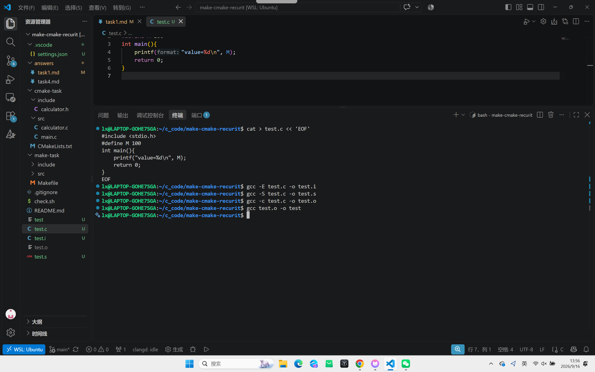

# Task 1：从 C 源码到可执行文件

请用自己的语言简要说明下面几个阶段分别做了什么：

### 1. 预处理
处理所有以 `#` 开头的**预处理指令**：
- `#include`：把头文件内容**原地展开**进来
- `#define`：预处理指令，作用是"文本替换",在预处理阶段，把代码中所有出现宏名的地方，原样替换成宏定义的内容
- 删除注释
- 处理 `#ifdef` 等条件编译

 ### 2. 编译

把预处理后的 C 代码翻译成**汇编代码**：
- 词法分析、语法分析、语义分析
- 生成中间代码
- 输出对应平台的汇编指令

### 3. 汇编

把汇编代码翻译成**机器码**，生成目标文件：
- 汇编器把每条汇编指令转成二进制机器指令
- 生成符号表、重定位信息
- 但外部函数（如 printf）的地址还没确定

### 4. 链接

把一个或多个目标文件和库**合并**成最终可执行文件：
- 符号解析：把 `printf` 等外部引用对应到库里的实现
- 重定位：给所有函数、变量分配最终地址
- 链接标准库（libc）、启动代码

建议控制在 300～500 字，不需要展开复杂细节。
## 过程记录

