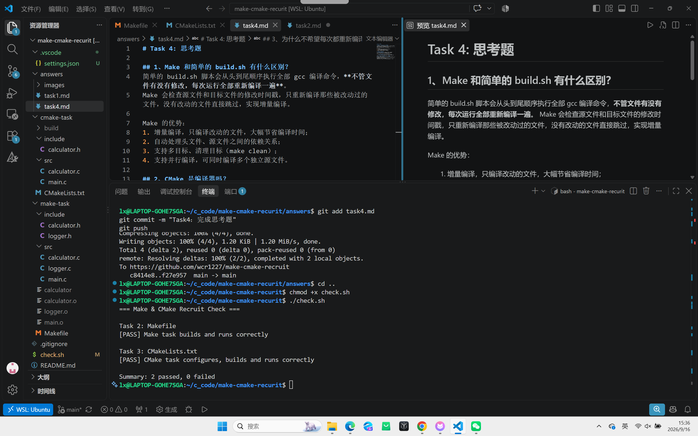

# Task 4: 思考题

## 1、Make 和简单的 build.sh 有什么区别？
简单的 build.sh 脚本会从头到尾顺序执行全部 gcc 编译命令，**不管文件有没有修改，每次运行全部重新编译一遍**。
Make 会检查源文件和目标文件的修改时间戳，只重新编译那些被改动过的文件，没有改动的文件直接跳过，实现增量编译。

Make 的优势：
1. 增量编译，只编译改动的文件，大幅节省编译时间；
2. 自动处理头文件、源文件之间的依赖关系；
3. 支持多目标、清理目标（make clean）；
4. 支持并行编译，可同时编译多个独立源文件。

## 2、CMake 是编译器吗？
执行 `cmake --build build` 时，最终是谁在编译 C 源文件？
CMake **不是编译器**，它是构建系统生成工具，只用来生成 Makefile / Ninja 等构建脚本，本身不做代码编译。

执行 `cmake --build build`，CMake 调用底层构建工具(make/ninja)，**真正把C源代码翻译成机器码的是 gcc（C语言编译器）**。

## 3、为什么不希望每次都重新编译所有 `.c` 文件？
项目有50个.c文件，仅修改其中一个，其余49个文件内容完全没变，它们编译出来的目标文件(.o)依旧可用。
全部重新编译属于无效重复工作，会浪费大量CPU时间，项目规模越大，全量编译耗时越长，降低开发调试效率。
只编译改动的那一个文件，再做链接，就可以得到新的可执行程序。## 自检脚本运行结果

